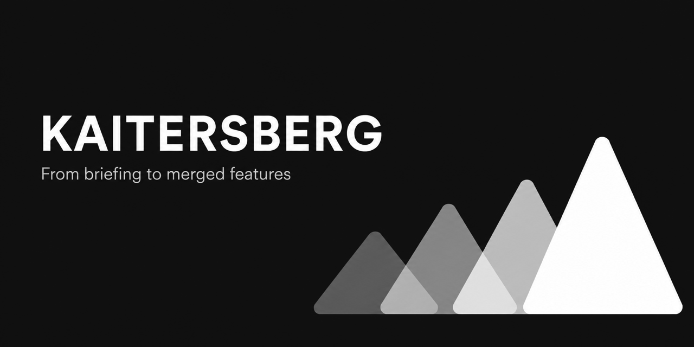

# Kaitersberg

Three skills that take a SaaS product from a rough briefing to a repository that
runs, with an agent doing the work and a human deciding the things worth deciding.

*The Kaitersberg is a ridge in the Bavarian Forest. Its tools live under
[grenzkamm](https://github.com/grenzkamm) - the crest the mountain stands on - and
what follows is named after the peaks around it.*

The premise: an agent that starts coding from a one-paragraph briefing builds
something plausible and wrong. So the first thing produced is not code - it is a
plan you can argue with. Everything after that reads the plan instead of guessing,
and where the plan is silent, the agent asks instead of inventing.

Kaitersberg plans the product and stands the repository up. It does not build
features and it does not judge them. That work belongs to skills written for it:
[agent-skills](https://github.com/addyosmani/agent-skills) and
[mattpocock/skills](https://github.com/mattpocock/skills). What Kaitersberg leaves
behind is what those skills read.



## Quick start

Install Kaitersberg once, then open the repository of the product you want to plan.
The first run turns a short briefing into reviewable planning documents; it does
not write product code.

**Claude Code**

```text
/plugin marketplace add https://github.com/grenzkamm/kaitersberg
/plugin install kaitersberg@kaitersberg
/kaitersberg:plan-product <your one-paragraph product briefing>
```

Run the first two commands once per installation and the last command inside your
product repository.

**Codex**

```bash
codex plugin marketplace add https://github.com/grenzkamm/kaitersberg
codex plugin add kaitersberg@kaitersberg
```

Start a new Codex thread in your product repository, then invoke:

```text
$kaitersberg:plan-product <your one-paragraph product briefing>
```

Review the generated product plan and feature map before continuing with
`/kaitersberg:architecture` or `$kaitersberg:architecture`.

## Project status

Kaitersberg is in its public testing phase. The document contracts may still change
before a stable 1.0 release, and it should not yet be treated as production-proven
automation.

The Claude Code path has been walked end to end to build demo SaaS products. Those
runs shaped the current checks and invariants, but they are not a claim that every
stack or production environment has been validated. The generated Codex port is
kept structurally in step and checked on every change; its complete product journey
has not yet been tested end to end. Codex users should expect rough edges and are
especially invited to report what does not carry across cleanly.

Questions and early feedback belong in [GitHub Discussions](https://github.com/grenzkamm/kaitersberg/discussions):
use [Q&A](https://github.com/grenzkamm/kaitersberg/discussions/categories/q-a)
for help with installing or using Kaitersberg,
[Ideas](https://github.com/grenzkamm/kaitersberg/discussions/categories/ideas) for
thoughts that are not yet concrete change requests, and
[Show and tell](https://github.com/grenzkamm/kaitersberg/discussions/categories/show-and-tell)
for experiences and projects built with it. Use issues for reproducible bugs and
concrete changes, and the private reporting route in [SECURITY.md](SECURITY.md) for
vulnerabilities.

Forking, adapting and experimenting with Kaitersberg is explicitly welcome under
the MIT licence. Improvements are wanted: open an issue for a broad change or send
a focused pull request when the change is ready. A fork does not owe the upstream
project compatibility, but generally useful fixes and new evidence are very welcome
back here.

## Privacy and legal scope

Kaitersberg helps teams identify personal data, retention questions, access
boundaries and security risks. Its recommendations are planning inputs, not legal
advice, and using the framework does not make a product automatically GDPR
compliant.

Before production use, the organisation operating the product remains responsible
for assessing and documenting the requirements that apply to its processing
activities. Depending on the product, the data and the parties involved, these may
include privacy notices, records of processing activities, data processing
agreements, retention and deletion procedures, processes for data subject requests,
technical and organisational security measures, international data transfer
safeguards and a data protection impact assessment. The applicable duties follow
from the specific context; consult a qualified data protection professional where
appropriate. See the official [General Data Protection Regulation](https://eur-lex.europa.eu/eli/reg/2016/679/oj/eng).

---

## Every step, in order

Once per machine, then three times per product, then once per feature for as long
as the product lives.

| | Step | What it is | Whose |
|---|---|---|---|
| **0** | `/plugin marketplace add` · `/plugin install` | The skills, once per machine | - |
| **1** | `/plan-product <briefing>` | PRD, feature board with waves, data model, journeys, roles, app shell, `CLAUDE.md` | Kaitersberg |
| **2** | `/architecture` | The house style, decided once for all features | Kaitersberg |
| **3** | `/scaffold` | `PROJ-1`: a repository that actually runs, proven from a clean state | Kaitersberg |
| **4** | `mattpocock:grilling` | One question at a time until you and the agent mean the same feature | outside |
| **5** | `agent-skills:spec` | The specification, into `features/PROJ-x-<name>/spec.md` | outside |
| **6** | you | `status: ready` and `verified` in that spec, `Ready` on the board | **you** |
| **7** | `agent-skills:plan` | The task list, into `features/PROJ-x-<name>/tasks.md` | outside |
| **8** | `superpowers:using-git-worktrees` | The branch and the worktree, without landing one inside another | outside |
| **9** | `agent-skills:build auto` | The code, one commit per task | outside |
| **10** | `agent-skills:test` · `review` · `ship` | The proof, the diff against the spec, the go or no-go - **in a session that did not build it** | outside |
| **11** | `superpowers:verification-before-completion` | No completion claim without the fresh evidence in the same message | outside |
| **12** | `gh pr create`, then `superpowers:finishing-a-development-branch` | The pull request and the merge | you |
| | **↻** | Steps 4 to 12 again, for the next feature in wave order | |

## Running it without knowing any of this

You do not have to remember the chain, and neither does the next session. Step 1
writes a `CLAUDE.md` into the product repository that carries it: where the
documents are, which skill does which step, and which rung of the board each step
leaves behind. Every session reads that file first.

So after the product is planned, one sentence runs a feature, over and over, in a
fresh session each time:

**Claude Code**

```text
cd <product repository> && claude
```

```text
PROJ-7. Read CLAUDE.md and features/INDEX.md, see where the feature stands, and do
the next step of the chain.
```

**Codex**

Start a thread in the product repository and paste the same sentence. Codex reads
`AGENTS.md`, which `/plan-product` writes with the same content.

The board is what makes this work. It says which rung the feature is on, the chain
table says what comes after that rung, and the session finds both without being
told. You never name a skill; the file does.

**Two steps stay yours, and no sentence delegates them:**

- **The release.** `status: ready` and `verified` in that feature's `spec.md`, and
  `Ready` on the board. No skill sets those two lines, which is the whole point of
  them.
- **A fresh session for the judgement.** Close the session that built the feature
  and open a new one before `agent-skills:test`. A reviewer who watched it being
  built shares the assumptions that produced its bugs, and a chat window with the
  build still in it is not a fresh reviewer.

When something goes wrong mid-run, the same sentence still works: the board has not
moved, so the next session starts where the last one stopped.

[docs/process.md](docs/process.md) tells the same story the other way round: what
each stage decides, what it receives and hands over, where the work comes back and
where a person is required.

[docs/workflow.excalidraw](docs/workflow.excalidraw) is the same chain as one
picture: every skill coloured by who wrote it, every file it reads and writes, what
`CLAUDE.md` holds, the two paths work takes back, and the board underneath. Open it
at [excalidraw.com](https://excalidraw.com) and export PNG or SVG for a talk.
[docs/workflow-de.excalidraw](docs/workflow-de.excalidraw) is the same drawing in
German; the two are edited separately, so a change to one is a change to both.

**Name the paths when you call the writing skills.** Left alone,
`agent-skills:spec` writes `SPEC.md` into the repository root and
`agent-skills:plan` writes `tasks/plan.md`, which is one specification per
repository. A board with twenty rows needs one per feature:

```text
/spec       write the specification to features/PROJ-x-<name>/spec.md
/plan       read that spec, write the task list to features/PROJ-x-<name>/tasks.md
/build auto the specification is "…/spec.md" and the task list is "…/tasks.md"
```

**When something happens that the order above does not cover:** a defect starts at
`mattpocock:diagnosing-bugs` and is proved fixed by `agent-skills:test` before
anything else changes. A feature request that arrives mid-flight gets a row on the
board and a place in a wave, by hand, before anybody specifies it. A branch that
collides with the default branch is run by `mattpocock:resolving-merge-conflicts`
before the pull request: always resolve, never abort, and read why each side exists
in that feature's own `spec.md`.

**The board is written on the default branch, never on a feature branch.** A claim
committed inside a worktree is invisible to every other session until the feature
merges, so the next one takes a feature that is already owned - and two branches
editing the same table row collide on every merge. The specification and the task
list belong to the feature branch; `features/INDEX.md` does not.

---

## The three skills

| Skill | Does | Runs |
|---|---|---|
| `/plan-product <briefing>` | Briefing → PRD, feature board with waves, data model, journeys, roles, app shell, local dev, `CLAUDE.md` | Once per product |
| `/architecture` | `docs/architecture.md`: module boundaries, the request path, where tenant isolation is enforced, error handling, background work, migrations, the quality gate with its numbers | Once per product, after planning |
| `/scaffold` | `PROJ-1`: services in containers, migrations, seed data, test harness, quality gate, CI - and a proof that every documented command was actually run | Once per product, after the architecture |

They run in that order and each reads what the one before it wrote. After
`/scaffold` the documented commands have actually been run, so `docs/local-dev.md`
is true rather than merely written.

`/plan-product` and `/architecture` write no code and no configuration. `/scaffold`
is the only skill allowed to write configuration and start services. No skill ever
writes `.env.local`.

## What the planning produces

```
CLAUDE.md              What every later session reads first
docs/PRD.md            Vision, users, features, success criteria, constraints
                       incl. the non-functional ones, non-goals, risks, and
                       every deliberate deviation from your briefing
docs/data-model.md     Entities, relations, tenant isolation, the vocabulary -
                       and what is deliberately not an entity
docs/journeys.md       Signup to first value in n steps, the empty account,
                       one core journey per role
docs/access.md         Roles, the full permission matrix, plan gating
docs/app-shell.md      Shells per auth state, layout, navigation, route map
docs/design-system.md  Only when you supplied a mockup. Never invented.
docs/sources/          Only when material came from outside - regulations,
                       standards, contracts, mockups - with what rests on each
docs/local-dev.md      Ports, commands, external accounts, deploy target
docs/architecture.md   The house style, incl. the quality gate with its numbers
features/INDEX.md      Every feature: priority, dependencies, size, wave, scope
.env.local.example     Every variable, placeholders for secrets
```

The `CLAUDE.md` it writes names the chain above, so a session that arrives later
does not have to be told which skills build this product.

---

## What it needs

| | For | Why |
|---|---|---|
| [Claude Code](https://claude.com/claude-code) or the Codex desktop app with Codex CLI | everything | The skills are plugins for one of the two |
| `git` | everything | Features are built in worktrees |
| The build and review skills | every feature after `PROJ-1` | [agent-skills](https://github.com/addyosmani/agent-skills) for spec, plan, build, test, review and ship; [mattpocock/skills](https://github.com/mattpocock/skills) for grilling and bug diagnosis |
| `shellcheck`, `ruff` | contributing | `scripts/check.sh` falls back to a syntax check when they are missing; `ruff.toml` owns the explicit Python rule set so a Ruff release cannot silently change the gate |

**No MCP server, no API key, no account beyond the harness you already use, and no
network at run time.** The skills read the repository they are in. A documentation
server or web search speeds up a library lookup and nothing more.

What the skills write in your repository - the specifications, task lists, reviews,
reports and code - is yours. The licence covers the skills themselves.

## Install the framework as a plugin

The repository is a marketplace for both Codex and Claude Code. The installed
plugin is named `kaitersberg`; its namespace prevents collisions with unrelated
skills that happen to use names such as `architecture`.

Both hosts can add this repository as a marketplace from its URL or from a local
clone. The URL form needs nothing checked out:

```bash
codex plugin marketplace add https://github.com/grenzkamm/kaitersberg
codex plugin add kaitersberg@kaitersberg
codex plugin marketplace add /absolute/path/to/kaitersberg   # or a clone
```

Alternatively, restart the ChatGPT desktop app, open the Plugins Directory, select
the **Kaitersberg** source and install the plugin there. Invoke a skill as, for
example, `$kaitersberg:architecture`.

For Claude Code, run these commands inside a session:

```text
/plugin marketplace add https://github.com/grenzkamm/kaitersberg
/plugin install kaitersberg@kaitersberg
```

A local clone works in place of the URL, which is what you want while changing
skills: `/plugin marketplace add /absolute/path/to/kaitersberg`.

If Claude Code asks for a reload, run `/reload-plugins`. Invoke the same workflow
as `/kaitersberg:architecture`.

After changing skills and regenerating the bundles, refresh both local plugin
installations from the framework checkout with:

```bash
scripts/update-installed-plugins.sh
```

The script validates the generated port and both marketplace manifests, adds one
shared `+codex.local-<UTC timestamp>` cachebuster to the two plugin versions,
updates Codex and Claude Code, and verifies the installed versions. The cachebuster
changes are intentional for local iteration, but are not a semantic release
version. For a release, set the intended version in both manifests, commit it, and
run the script with `--no-version-bump`. Use `--dry-run` to inspect the operation
without changing files or installations. Start a new Codex thread and restart
Claude Code after the update so active sessions do not retain the old skill
instructions. Product repositories require no update command of their own.

Installing the plugin supplies the workflows, not a product's planning artefacts.

---

## The two rules that make it work

**Where the documents are silent, the agent asks.** An invented behaviour is a
defect that passes review, because nobody specified otherwise. Every skill carries
this rule, and it is why the specification is worth its length.

**Lifecycle rungs only move forward.** `Roadmap` → `Spec` → `Ready` →
`In Progress` → `In Review` → `Done`, plus `Dropped` for a feature that gets cut.
Test, review, corrections and CI all stay `In Review`, so findings do not bounce
the board. The three rungs around the build are moved by the human, because the
build belongs to the human.

## Conventions

- **Feature IDs** are `PROJ-1 … PROJ-n`. `PROJ-1` is always the scaffold.
- **Priority follows dependencies**, not enthusiasm. P0 is what other features
  cannot exist without.
- **Build order is waves.** Wave 1 depends on nothing; wave *n* only on earlier
  waves. Within a wave, features are cut so they can be built in parallel.
- **Wave 1 is demoable.** Dependency order alone gives you three weeks of auth and
  empty tables, so the thinnest end-to-end slice is pulled forward.
- **Specs are written just in time** - one board row per feature, the full document
  only when the feature is next. Fourteen specs written up front rot unread.
- **Everything about a feature lives in its folder**, including the evidence.
- **Tests come before the code**, and each is seen failing before it is made to
  pass. A test that was never red proves nothing.
- **Commits** are `feat(PROJ-x): …`, `fix(BUG-n): …`, `docs(PROJ-x): …`.

## Repository layout of a product built this way

```
CLAUDE.md
docs/                            The plan and the architecture
docs/sources/                    What came from outside, and what rests on it
features/INDEX.md                The board
features/PROJ-x-<name>/          One folder per feature
  spec.md · tasks.md             Written before the build, on the default branch
bugs/INDEX.md · bugs/BUG-n-*.md  The short path
.worktrees/PROJ-x-<name>/        One worktree per feature being built
```

---

## Harnesses

The framework is authored for **Claude Code** and generates its **Codex** port from
the same source. Both variants are distributed through one namespaced plugin.

Everything that carries the actual thinking - the phases, the hard rules, the
document skeletons, the status ladder, the checklists - is harness-neutral prose and
ports unchanged. What is Claude Code specific is small, and listed here so a port
knows exactly what it has to replace:

| Claude Code specific | What it is | What a port needs |
|---|---|---|
| `.claude/skills/<name>/SKILL.md` | Where a skill lives and is discovered | The equivalent location for that harness |
| Frontmatter `user-invocable`, `allowed-tools`, `model`, `argument-hint`, `disable-model-invocation` | How the harness registers and constrains a skill - the last one keeps `/scaffold` from being called by a model that thought some configuration would help | The equivalent fields, or nothing |
| `/skill-name` invocation | How a user starts one | The harness's own invocation |
| `CLAUDE.md` | The file every Claude session reads first | The harness's context file - `AGENTS.md` for Codex. Generated templates use an explicit plain-path reading list, because Claude's `@path` imports are silent no-ops in Codex |

The rest - the discipline that where the documents are silent the agent asks, that
a briefing is turned into an argument before it is turned into code - is not
harness-specific at all.

`.agents/skills/` is the Codex port, and it is **generated** rather than
maintained: `scripts/port-to-codex.py` writes it from `.claude/skills/`, applying
exactly the replacements in the table above. The same run refreshes the
self-contained skill trees in `plugins/claude/kaitersberg/` and
`plugins/codex/kaitersberg/`, so marketplace installs never mix harness-specific
frontmatter. A change is made once, in `.claude/skills/`, and all bundles are
regenerated:

```
python3 scripts/port-to-codex.py            # write the port
python3 scripts/port-to-codex.py --check    # fail if it is stale
```

Never edit `.agents/skills/` or either generated plugin skill tree. The port is
regenerated and checked on every commit - `scripts/check.sh` fails when it is
stale.

## Where the documents live

The specification, the task list, the review and the test report are **files in the
repository**, and they stay there. The reason is one test: does this artifact have
to be true *at a commit*? A spec does - it must sit in the same diff as the code
that implements it, and it must still be findable at that commit a year later,
which is the only way anybody can compare `data-model.md` field by field against
the real schema, and the only way an agent can read it in a worktree with no
network and no credentials.

Status, ownership, discussion, notification and approval are the opposite: they are
about *now*, never about a commit. That is what an issue tracker is genuinely
better at, and that is the only part worth moving out.

So the direction of travel is fixed, and stated here rather than discovered by
every user separately: **the documents stay in the repository, a tracker may hold
state. Never the other way round.** Two places that both claim to hold the
specification is a drift nobody notices until it has cost a feature.

---

## Working on this repository

Contributions are welcome. Read [CONTRIBUTING.md](CONTRIBUTING.md) before a broad
change and follow the [Code of Conduct](CODE_OF_CONDUCT.md). Report vulnerabilities
through the private route in [SECURITY.md](SECURITY.md), never through a public
issue.

The checks are one command. The pre-commit hook and GitHub Actions run that same
command, so there is no second opinion about what green means:

```bash
git config core.hooksPath .githooks   # once per clone
scripts/check.sh                      # what the hook runs
```

It verifies that the Codex port and both plugin bundles are in step with
`.claude/skills/`, that every skill still obeys the rules this repository states
about skills - frontmatter, a template link that resolves, a handoff that names a
skill which exists, English - that the shell and Python under `scripts/` lint and
parse, and that the plugin manifests are valid JSON agreeing on one version. The
hook additionally refuses a staged `+codex.local-` version: that cachebuster is for
a local install and was never a release.

`scripts/lint-skills.py --selftest` checks the linter itself against a deliberately
broken skill, because a rule that never fires is decoration.

## This repository

```
.claude/skills/<name>/SKILL.md    The skill: role, hard rules, phases, checklist
.claude/skills/<name>/template.md The document skeleton it fills
.agents/skills/<name>/            The Codex port - generated, never edited by hand
.agents/plugins/marketplace.json  The Codex marketplace catalog
.claude-plugin/marketplace.json   The Claude Code marketplace catalog
.github/                          CI, issue forms and the pull request template
plugins/claude/kaitersberg/       The self-contained Claude Code plugin
plugins/codex/kaitersberg/        The self-contained Codex plugin
scripts/port-to-codex.py          What generates it, and the only place the
                                  harness differences are written down
scripts/update-installed-plugins.sh Refresh both cached local plugin installs
scripts/check.sh                  Every check this repository makes, one command
scripts/lint-skills.py            The rules in CLAUDE.md, enforced rather than recalled
ruff.toml                         The explicit Python lint contract
.githooks/                        pre-commit and commit-msg, enabled per clone with
                                  git config core.hooksPath .githooks
CLAUDE.md                         How a skill here is written, and the invariants
AGENTS.md                         The same for a Codex session - hand-written, the one
                                  file the port does not generate
```

**Walked end to end on demo SaaS products, and not finished.** With Claude Code,
products have been planned, stood up, built, reviewed and merged, including a
review that sent one feature back for a defect no test had caught. What those runs
corrected is in the git history of this repository, which is the honest measure of
how much a written-but-unrun skill is worth. The Codex path has not yet had the
same end-to-end run. Briefings and all generated product documents belong in
dedicated product repositories, not in this one.

Skills are written in English regardless of the briefing language; the documents
they produce follow the language of your briefing. See [CLAUDE.md](CLAUDE.md) for
how a skill in here is written and which invariants hold across all of them.

---

## Acknowledgements

Kaitersberg was inspired in part by workflow ideas from the
[AI Coding Starter Kit](https://github.com/alexpeclub/ai-coding-starter-kit) by
Alex Sprogis. Kaitersberg is an independent implementation and is not affiliated
with that project.

The build, test, review and ship half of the workflow is
[agent-skills](https://github.com/addyosmani/agent-skills) by Addy Osmani; the
grilling and bug-diagnosis half is [mattpocock/skills](https://github.com/mattpocock/skills)
by Matt Pocock. Kaitersberg is independent of both and is not affiliated with
either project.

---

## Licence

MIT - see [LICENSE](LICENSE). Forking, modification and redistribution are welcome.
The documents and code the skills produce in your own repository are yours; the
licence covers the skills, scripts and templates here.
